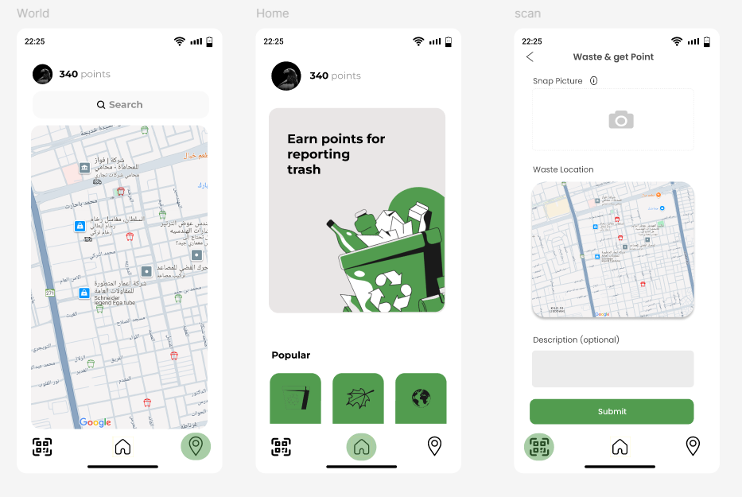

# ♻️ Waste Management Android App

## 📱 Overview
This project is an Android application developed using **Java** and **XML** for a **Waste Management System**.  
The app aims to improve environmental awareness and simplify waste handling by allowing users to report waste, request bins, and interact with location-based services.

---

## 🎯 Goal of This Project
The main objective of this application is to:
- Promote clean and sustainable environments 🌱
- Provide an easy way to report waste issues 📸
- Allow users to request waste bins 🗑️
- Use maps to locate and manage waste-related services 📍
- Apply practical Android development and data handling concepts

---

## 🚀 Features

### 🔐 Authentication System
- User registration and login
- Password reset functionality
- OTP verification for secure access

---

### 🏠 Home Page
- Central navigation hub
- Access to all main features of the application

---

### 📸 Waste Reporting
- Capture images using the camera
- Submit waste reports with details

---

### 🗺️ Map Integration
- Display locations using Google Maps
- View and interact with waste-related points

---

### 🗑️ Request Bin
- Users can request new waste bins
- Location-based requests with additional details

---

### 👤 User Profile
- View and manage user information

---

### ℹ️ Information Section
- Provides awareness and guidance about waste management

---

## 🛠️ Tech Stack

- **Language:** Java
- **UI:** XML (Android Layouts)
- **IDE:** Android Studio
- **Backend Services:** Firebase Authentication & Realtime Database
- **APIs:** Google Maps API
- **Other Features:** Camera Integration

---

## ⚙️ How to Run

1. Open the project in **Android Studio**
2. Sync Gradle files
3. Add your own API keys (Google Maps, Firebase if needed)
4. Run the application on an emulator or physical device

---

## 🔑 Important Notes

* The project uses **Google Maps API** → You must add your own API key
* Firebase is used for authentication and data storage → Configure your own Firebase project
* Do not upload sensitive keys (API keys or configuration files) to public repositories

---

## 📸 Screenshots

  

---

## 👨‍💻 Author

**Abdulmajeed Abdullah**
